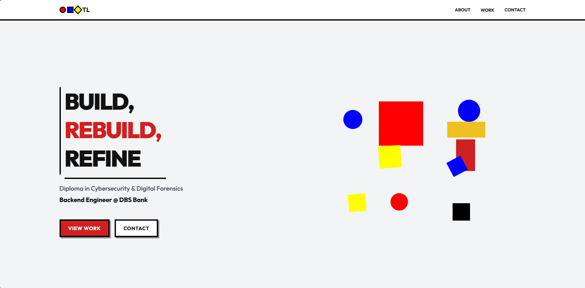

# Terron Loh's Portfolio

A modern, minimalist personal portfolio website built with React.

## 🚀 Overview

This is my personal portfolio website showcasing my work, projects, and skills. The site features a clean Bauhaus-inspired design with smooth animations and a responsive layout.

## 🛠️ Tech Stack

- **Framework:** React 19
- **Styling:** CSS Modules / Custom CSS
- **Deployment:** GitHub Pages

## 📦 Installation

```bash
# Clone the repository
git clone https://github.com/your-username/portfolio.git

# Navigate to project directory
cd portfolio

# Install dependencies
npm install

# Start development server
npm run dev
```

## 🏃‍♂️ Available Scripts

| Command | Description |
|---------|-------------|
| `npm run dev` | Start development server |
| `npm run build` | Build for production |
| `npm run preview` | Preview production build |


## 🔗 Live Site

Still working on github pages to get this website live!
Do stay tune ;)


## Portfolio Preview

